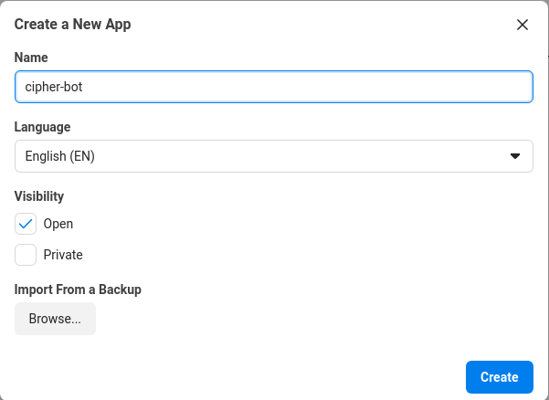
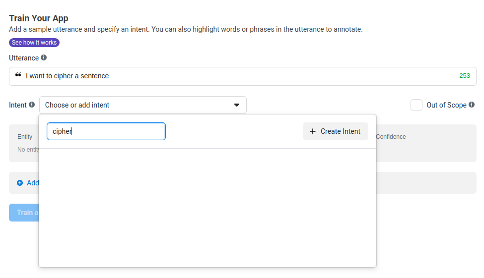
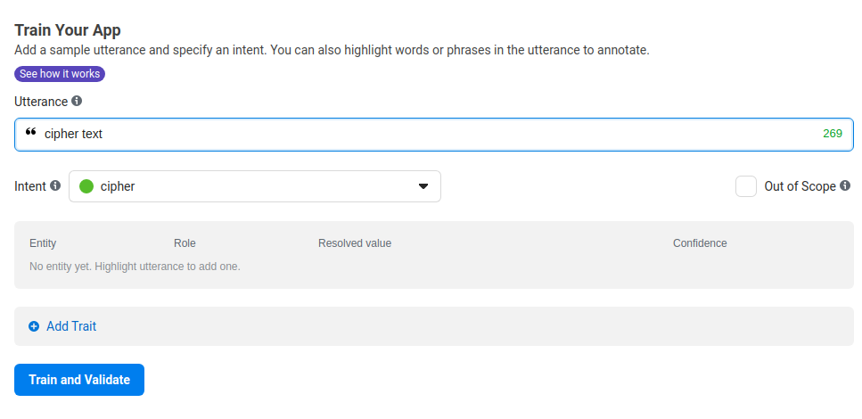
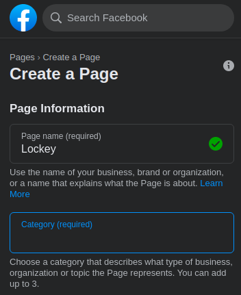
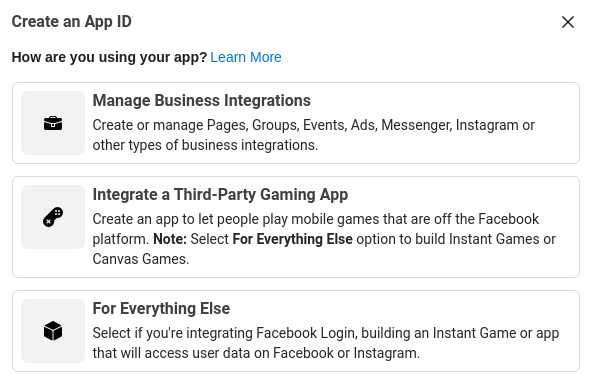
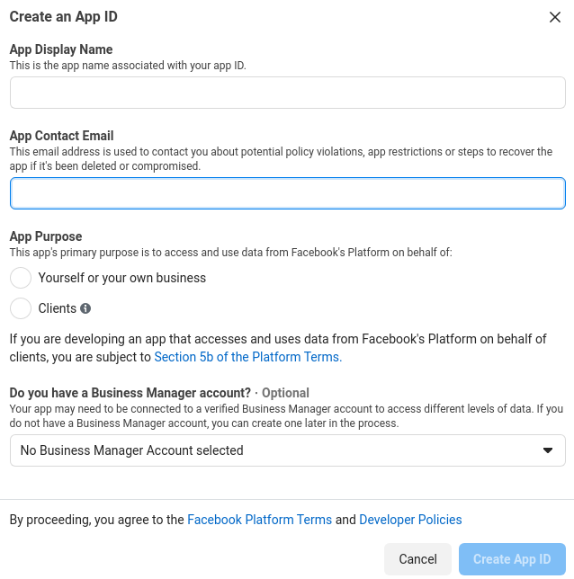
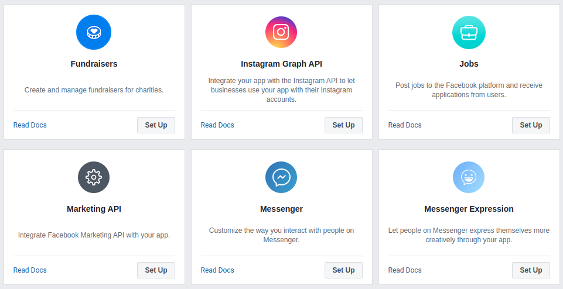
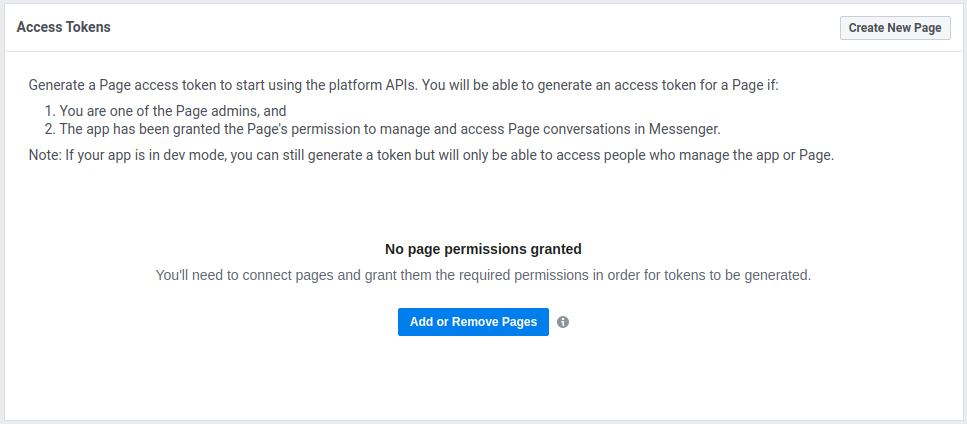

# Build a Message Encryptor/Decryptor Chatbot on Messenger using Wit.ai, Messenger, FastAPI, Heroku

## Overview
In this tutorial, we are going to learn what is wit and how can we use it to build a smart chatbot that can understand us and help us encrypt and decrypt messages using a secret key to help you transfer encrypted messages with your friends safely.

This tutorial will use wit for natural language understanding, FastAPI for deploying the web application we are going to use, Heroku for deploying our web application, and finally we will use send and receive our messages.

So these are the key points that we will cover:
*   Introduction about the tools used
*   Design the user interaction and cover the basic scenarios
*   Create and train a Wit app to do natural language processing (NLP)
*   Create a Facebook Page and Facebook App to host the chatbot
*   Create Web Application using FastAPI
*   Integrate Messenger and Wit App wit the Web Application
*   Deploy the Web Application using Heroku

## Prerequisites
*   Create a [Wit.ai](https://wit.ai/) account
*   Familiar with python programming
*   Familiar with Backend Development

## Introduction about the tools used
In this tutorial, We will create a chatbot on Messenger that will help users encrypt messages using a pre-generated key so they can share the encrypted message with their friends who will decrypt this message using the same pre-generated key. So we will start by giving a simple introduction to the frameworks and APIs we are going to use.

### Wit.ai
Wit is a natural language processing engine, It helps understand text and extract entities. And it makes the process of creating bots or apps that talk to people easier. In the scope of this project, we will use wit to understand the messages that will be sent by our users.

### FastAPI
FastAPI is a modern, fast (high-performance), web framework for building APIs. It’s very fast, intuitive, and easy to use. And it provides automatic swagger docs (Yaaaaay). 

### Heroku
Heroku is a cloud application platform that allows you to run your apps, Heroku is known for making the process of deploying, configuring, and scaling your apps easier and painless.

## Design the user interaction and cover the basic scenarios

This is usually the most important step in building a chatbot because it has a big impact on the user experience with the chatbot. So this step needs to be every revisited every now and then to ensure a good conversation flow and experience. In this tutorial we will not focus on this part and we will use a basic conversation flow like below.


First Time Encrypting Scenario
```
Bot:  "Hi John, I'm Lockey. I can encrypt and decrypt messages for you to keep your secrets. What can I do for you?"

User: "I want to encrypt a message"

Bot:  "I have created a new key. Keep it Safe!!"

Bot:  "tkDJnol2UKThgJ_R8wVKVAl_iGwOoywvo45gXWD4v6c="

Bot:  "Now enter the message that you want to keep safe."

User: "I love you Lockey"

Bot:  "This is the encrypted message. It'll only be decrypted using the key that you used"

Bot: "gAAAAABfcNeVsjnOLuz0FuWCPZSNwuun2Emb4kmekRWDE9_Wh4mgqxPioS5zd86KdsI-ubTHD0wS1SdKJjRPhy04kmgbJbQizg=="

Bot:  "Do you want to encrypt anything else?"
```

Next Time Encrypting Scenario
```
Bot:  "Hi John, I'm Lockey. I can encrypt and decrypt messages for you to keep your secrets. What can I do for you?"

User: "I want to encrypt a message"

Bot:  "It seems that you have an already generated key, Do you want to keep using it?"

User:  "Yes"

Bot:  "Great. Now enter the message that you want to keep safe."

User: "I love you Lockey"

Bot:  "This is the encrypted message. It'll only be decrypted using the key that you used"

Bot: "gAAAAABfcNeVsjnOLuz0FuWCPZSNwuun2Emb4kmekRWDE9_Wh4mgqxPioS5zd86KdsI-ubTHD0wS1SdKJjRPhy04kmgbJbQizg=="

Bot:  "Do you want to encrypt anything else?"
```

Decrypting Scenario
```
Bot:  "Hi John, I'm Lockey. I can encrypt and decrypt messages for you to keep your secrets. What can I do for you?"

User: "I want to decrypt a message"

Bot:  "Please enter the key that has been shared with you to decrypt the message"

User:  "tkDJnol2UKThgJ_R8wVKVAl_iGwOoywvo45gXWD4v6c="

Bot:  "Now enter the message that you want to decrypt."

User: "gAAAAABfcNeVsjnOLuz0FuWCPZSNwuun2Emb4kmekRWDE9_Wh4mgqxPioS5zd86KdsI-ubTHD0wS1SdKJjRPhy04kmgbJbQizg=="

Bot:  "This is the decrypted message. Keep it safe and delete after you read it."

Bot:  "I love you Lockey"

Bot: "Do you want to decrypt anything else?"
```

## Create and train a Wit app to do natural language processing

* Create a new Wit App
    * Choose the name of your app
    * Choose the language of the app **English**
    * Choose whether you want the app **Open** or **Private**
    * Click **Import** if you have a previous wit app or if you want to export the wit app used in this tutorial press [here](https://storage.googleapis.com/iam-sultan/cipher-bot-2020-10-03-07-00-12.zip)
    * Click **Create**



* We will be redirected to the understanding page where we will enter utterances or training data. And you'll notice that for every utterance we enter we will need to specify the intent of that utterance (Or create the intent in case if it doesn't exist) And after every utterance click on **Train and Validate**.



* You'll notice that over time Wit will automatically match the utterances that you enter with the correct intent and that indicates that we are on the right path.



* We will keep entering data and creating intents. We will mainly use 6 intents:
    * `greeting`
    * `cipher`
    * `decipher`
    * `new_key`
    * `yes`
    * `no`

* We can find all the utterances in the utterances page.

* We can also test the Wit App using a curl request that is generated automatically by going to the **Settings** page


* In the same page we can get the **Server Access Token** as we will use it later when we build the app


## Create a Facebook Page and Facebook App to host the chatbot

For this part, we are going to create two things:

### 1. Facebook Page

* Go to this [page](https://www.facebook.com/pages/creation/?ref_type=comet_home) to start the process of creating the new page
* Then choose your page name and category and click on the create button (And yes that's it you now have a page)



### 2. Facebook App

* Go to [Facebook for Developers](https://developers.facebook.com/) and create an account if you don't have one and click on the **Create App** Button
* Choose **Manage Business Integrations**



* Fill the required information and click on the **Create App ID**



* Then from the list of products shown, Click on **Set Up** on the Messenger card



* In the **Access Tokens** Section, Click on the **Add or Remove Pages** Button and choose the page that we created earlier and agree on the permissions needed.



* Then click on the **Generate Token** Button and keep the generated token safe as we will use it later.


## Create Web Application using FastAPI

This section illustrates how can you use this repo to build the chatbot on your own page. You can find the source code in this [repo](https://github.com/Ahmed0Sultan/cipher-chatbot) so download it and follow these steps.

### This is a tree that demonestrates the files and directories in the project.

```
└── cipher-chatbot
    ├── api
    │   ├── api.py
    │   └── endpoints
    │       └── facebook.py
    ├── connector
    │   └── facebook
    │       ├── bot.py
    │       └── utils.py
    ├── core
    │   ├── db
    │   │   ├── crud.py
    │   │   ├── database.py
    │   │   └── models.py
    │   ├── dialog
    │   │   ├── actions.py
    │   │   ├── manager.py
    │   │   └── responses.py
    │   └── nlp
    │       └── engine.py
    ├── LICENSE
    ├── main.py
    ├── README.md
    ├── requirements.txt
    └── variables.py
```

### Set Environment Variables
Create a new file named `.env` which will contain the secret tokens that we will use to integrate with Wit and Messenger